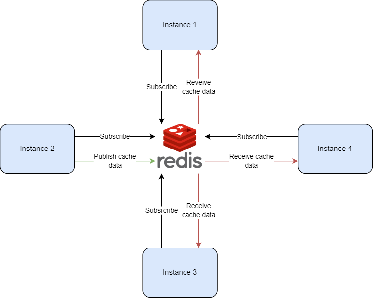

  <h1> In-Memory Cache Synchronization </h1>

The main idea of this project is to develop a solution for synchronizing data stored in memory across multiple instances of an application using Redis Pub/Sub. The application employs an in-memory caching method, and the goal is to ensure data consistency among all instances.

The solution involves setting up a system where any update to the data in the memory of any instance is broadcasted to a Redis channel. All instances then subscribe to this channel to receive updates, enabling them to synchronize their in-memory data with changes made by other instances.

In summary, this project aims to maintain data consistency across multiple instances of an application that uses in-memory caching by leveraging Redis Pub/Sub to publish and synchronize data updates across all instances

